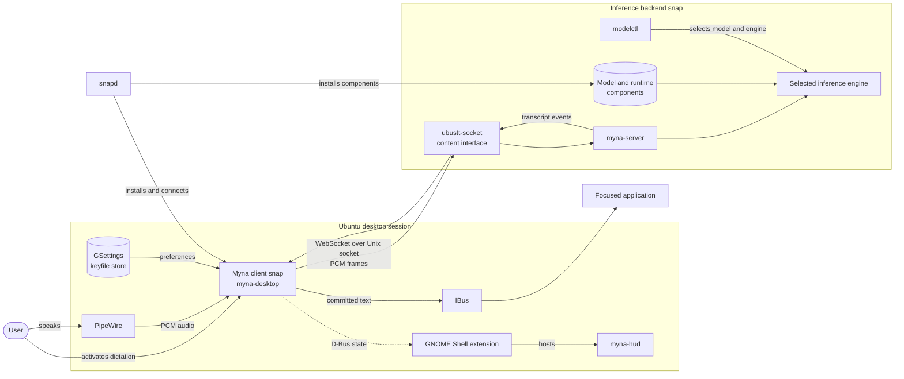

# Preface

Read this document for a visual overview of Myna's runtime components and trust boundaries. Use the subsystem diagrams for implementation-level structure.

Read the top-level `.kb/agents.md` file before continuing below.

# Architecture

The client is the only component with microphone and desktop access. Inference backends receive PCM through a connected local Unix socket and do not access the network or microphone. Unstable text remains presentation state; only committed text reaches IBus.
