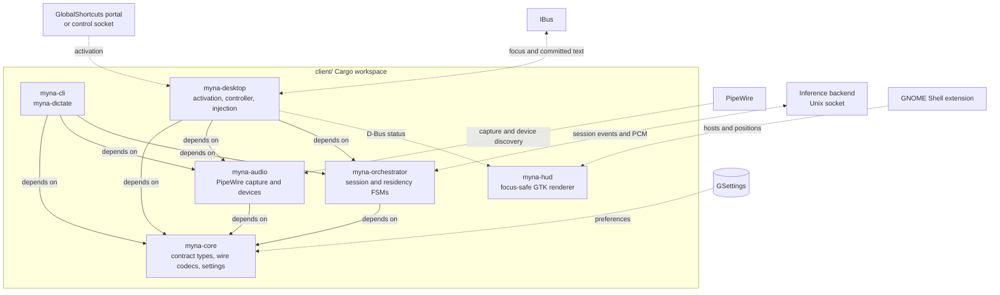

# Preface

Read this document when changing Rust workspace dependencies or deciding which crate should own new client behavior.

Read the top-level `.kb/agents.md` file before continuing below.

# Architecture

Solid arrows are Cargo dependencies. Dashed arrows are runtime integration boundaries.

`myna-core` is the lowest internal layer and must not depend on higher-level crates. `myna-audio` and `myna-orchestrator` are peers over the core contract. Product binaries compose those boundaries; `myna-hud` remains a separate process and consumes status over D-Bus rather than linking to `myna-desktop`.
