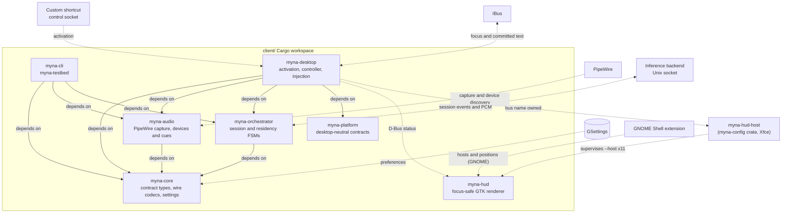

# Preface

Read this document when changing Rust workspace dependencies or deciding which crate should own new client behavior.

Read the top-level `.kb/agents.md` file before continuing below.

# Architecture

Solid arrows are Cargo dependencies. Dashed arrows are runtime integration boundaries.

```mermaid
flowchart TB
    subgraph workspace["client/ Cargo workspace"]
        core["myna-core<br/>contract types, wire codecs, settings"]
        platform["myna-platform<br/>desktop-neutral contracts"]
        audio["myna-audio<br/>PipeWire capture, devices and cues"]
        orchestrator["myna-orchestrator<br/>session and residency FSMs"]
        cli["myna-cli<br/>myna-testbed"]
        desktop["myna-desktop<br/>activation, controller, injection"]
        hud["myna-hud<br/>focus-safe GTK renderer"]

        audio -->|"depends on"| core
        orchestrator -->|"depends on"| core
        cli -->|"depends on"| core
        cli -->|"depends on"| audio
        cli -->|"depends on"| orchestrator
        desktop -->|"depends on"| core
        desktop -->|"depends on"| audio
        desktop -->|"depends on"| orchestrator
        desktop -->|"depends on"| platform
    end

    pipewire["PipeWire"] -.->|"capture and device discovery"| audio
    backend["Inference backend<br/>Unix socket"] <-.->|"session events and PCM"| orchestrator
    gsettings[("GSettings")] -.->|"preferences"| core
    shortcut["Custom shortcut<br/>control socket"] -.->|"activation"| desktop
    ibus["IBus"] <-.->|"focus and committed text"| desktop
    desktop -.->|"D-Bus status"| hud
    shell["GNOME Shell extension"] -.->|"hosts and positions (GNOME)"| hud
    hudhost["myna-hud-host<br/>(myna-config crate, Xfce)"] -.->|"supervises --host x11"| hud
    desktop -.->|"bus name owned"| hudhost
```

`myna-core` is the lowest internal layer and must not depend on higher-level crates. `myna-platform` sits beside it with no internal dependency at all: it holds the contracts every desktop backend implements and must stay free of GTK, D-Bus and gio (myna-core links gio, so the platform crate does not depend on it). Backends live in the crate of the process that runs them (`.kb/platform-layer.md`). `myna-audio` and `myna-orchestrator` are peers over the core contract. Product binaries compose those boundaries; `myna-hud` remains a separate process and consumes status over D-Bus rather than linking to `myna-desktop`. On Xfce `myna-hud-host`, a binary of `myna-config` shipped in the deb, takes the shell extension's place: it runs `myna-hud --host x11` while the daemon owns its bus name (`.kb/platform-layer.md`).
