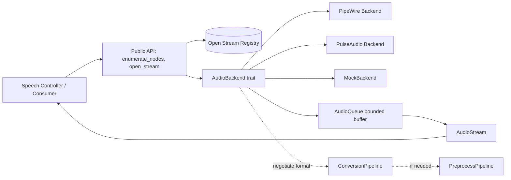
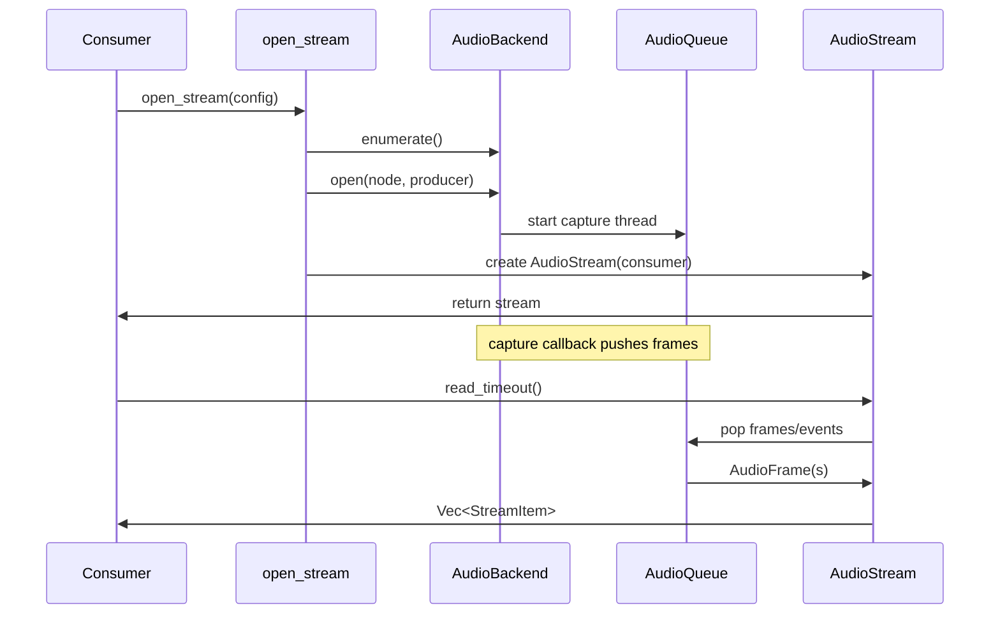
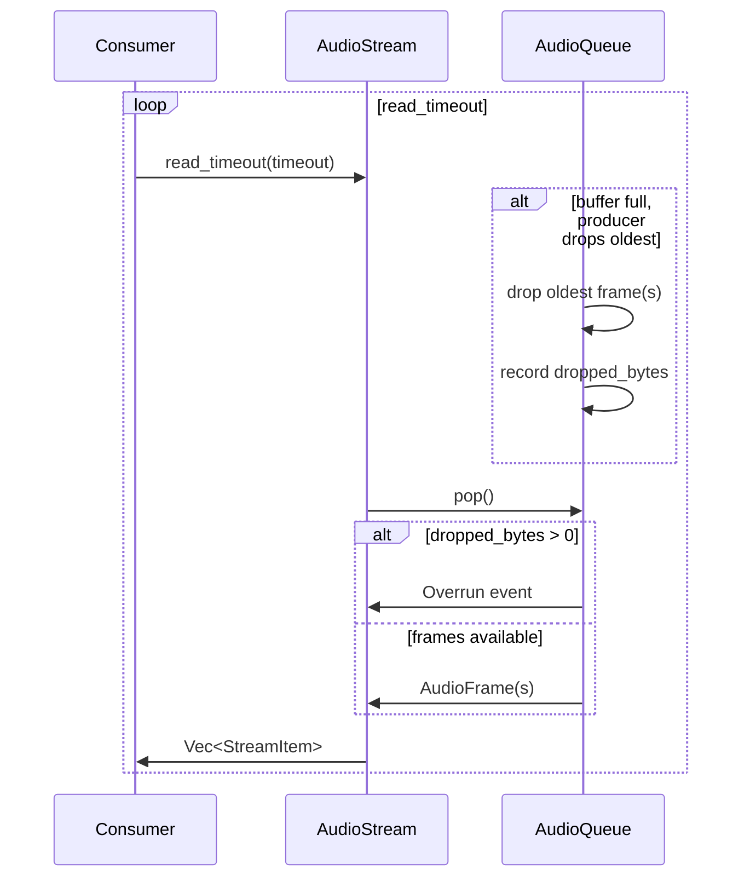
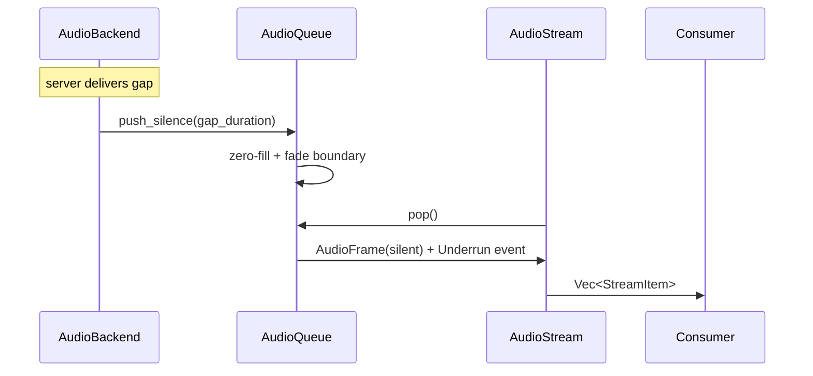
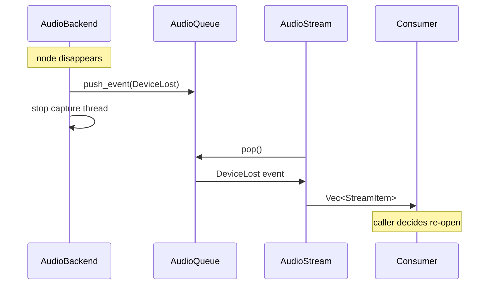
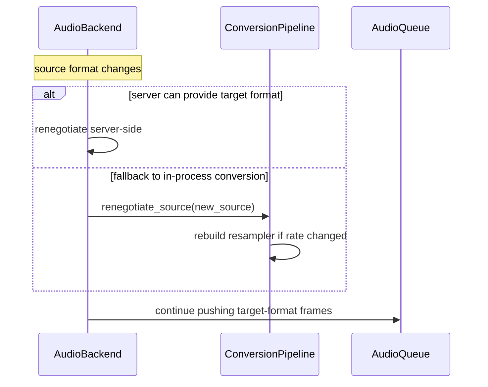

# Audio Adapter Library Architecture

## Component Block Diagram

## Stream Open and First-Frame Delivery

## Consumer Read Loop with Overrun

## Underrun Silence Fill

## Device Loss

## Mid-Stream Format Renegotiation

