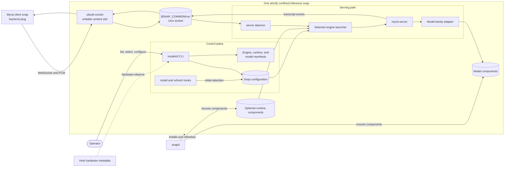

# Preface

Read this document when changing the common structure or runtime flow of an inference snap. Individual snap manifests remain authoritative for model-specific differences.

Read the top-level `.kb/agents.md` file before continuing below.

# Architecture

The base snap carries the control CLI, manifests, launch scripts, and Python server. Model weights and large optional runtimes are components so they can be installed independently. `modelctl` selects an engine and model through persistent snap configuration; the daemon serves that selection through the shared Unix-socket contract.

# Important

- This is the common shape, not a requirement that every family have multiple engines or runtime components.
- The content interface is the only client/backend data path.
- `network-bind` permits listening on the Unix socket; it does not imply a TCP service.
- Inference snaps do not receive microphone or general network access.
