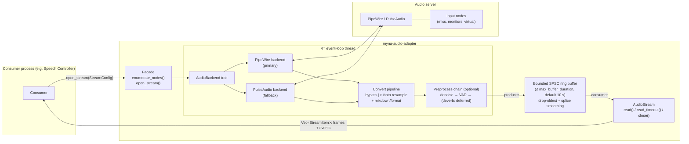
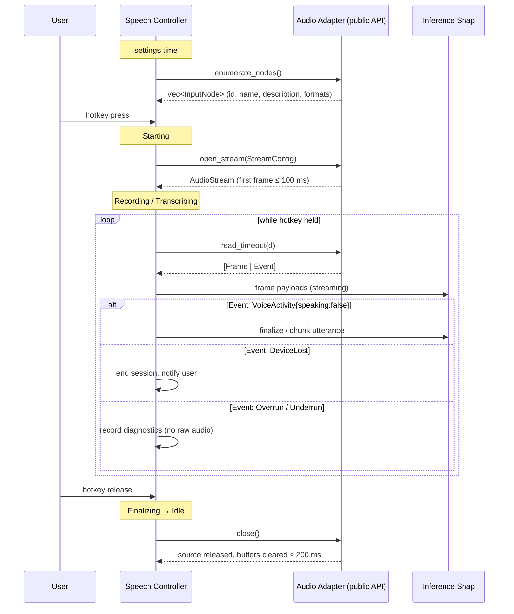
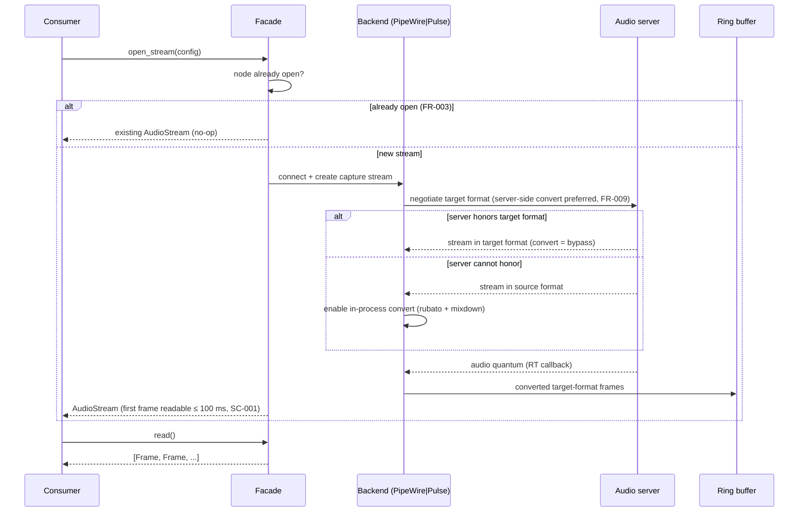
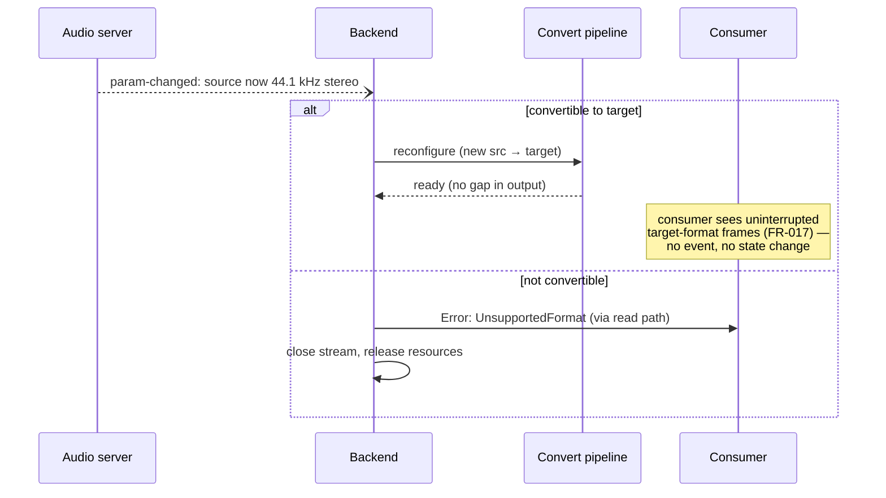
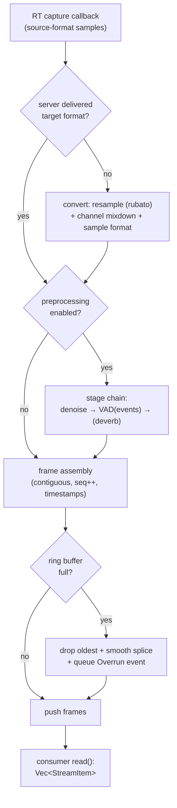

# Diagrams: Audio Adapter Library

**Feature**: `001-rust-audio-adapter` | Satisfies FR-019; diagram 2 documents the known-consumer API surface (FR-020). Cross-references: [data-model.md](data-model.md), [contracts/audio-adapter-api.md](contracts/audio-adapter-api.md) (guarantees G1–G15).

## 1. Architectural block diagram

Components of `myna-audio-adapter` and their relationships. The real-time (RT) side runs on the backend's event-loop thread; the consumer side is whatever thread calls `read()`.



## 2. Sequence: Speech Controller push-to-talk session over the consumer API surface (G15, FR-020)

How the known primary consumer (Speech Controller, `docs/architecture/UD129`) drives the adapter through one dictation session. Only the API surface shown here is consumer-facing; UD129 session states are on the left.



## 3. Sequence: stream open and first-frame delivery (G7, G9)



## 4. Sequence: read loop with slow consumer — overrun (G3)

```mermaid
sequenceDiagram
    participant S as Audio server (RT)
    participant R as Ring buffer
    participant C as Consumer

    loop every audio quantum
        S->>R: push converted frames
    end
    Note over C: consumer stalls...
    S->>R: push (buffer at capacity)
    R->>R: drop OLDEST frames (FR-014)<br/>record dropped span<br/>smooth splice boundary (~5 ms fade, FR-015)
    C->>R: read()
    R-->>C: [Event: Overrun{dropped}, Frame, Frame, ...]
    Note over C: timeline stays ordered;<br/>loss is explicit, audio artifact-free
```

## 5. Sequence: audio-server underrun — silence fill (G4)

```mermaid
sequenceDiagram
    participant S as Audio server (RT)
    participant B as Backend
    participant R as Ring buffer
    participant C as Consumer

    S->>B: quantum n
    B->>R: frames (real audio)
    Note over S: server delivers nothing<br/>for a short span (underrun)
    B->>B: detect gap in capture clock
    B->>R: synthetic silence for missing span (FR-018)<br/>fade real→silence and silence→real (FR-015)
    S->>B: quantum n+k (audio resumes)
    B->>R: frames (real audio)
    C->>R: read()
    R-->>C: [Frame, Event: Underrun{filled}, Frame(silence), Frame, ...]
    Note over C: timeline continuous and wall-clock aligned;<br/>silent span flagged as synthetic
```

## 6. Sequence: input node lost mid-stream (G5)

```mermaid
sequenceDiagram
    participant S as Audio server
    participant B as Backend
    participant R as Ring buffer
    participant C as Consumer

    S--)B: node removed (registry event)
    B->>R: enqueue Event: DeviceLost{node}
    B->>B: close server stream,<br/>release source, stop RT processing (FR-016)
    C->>R: read()
    R-->>C: [...remaining frames, Event: DeviceLost]
    Note over C: stream is closed/terminal;<br/>consumer decides whether to re-open<br/>on another node — library never retargets
```

## 7. Sequence: mid-stream source format change — transparent renegotiation (G6)



## 8. Flow: per-quantum data path (G1, G2, G12)


