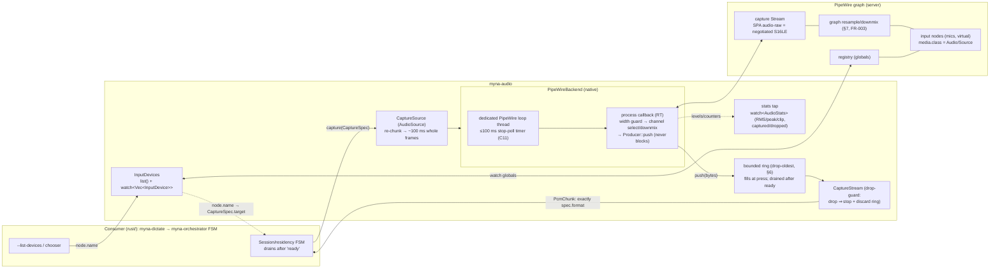
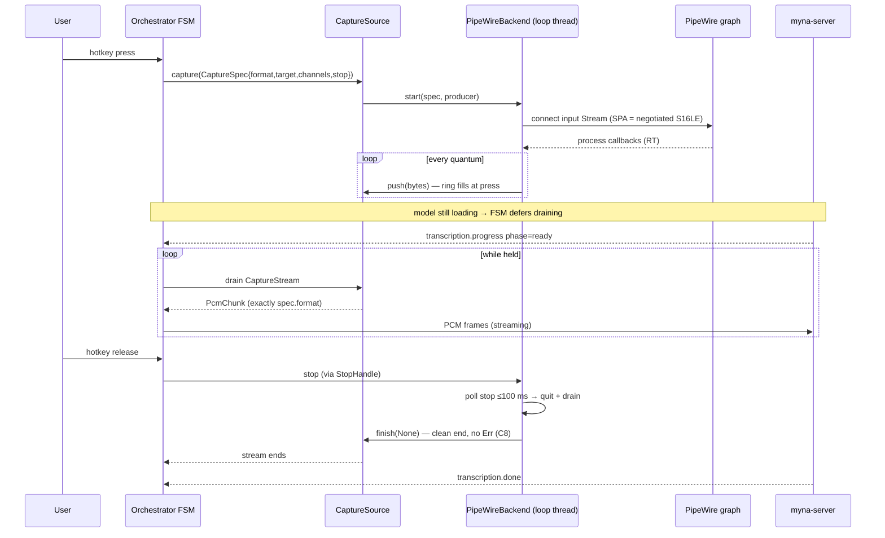
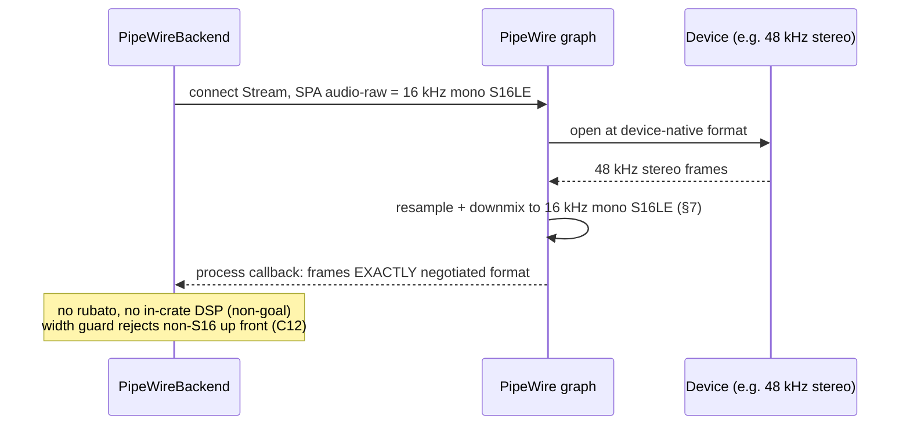
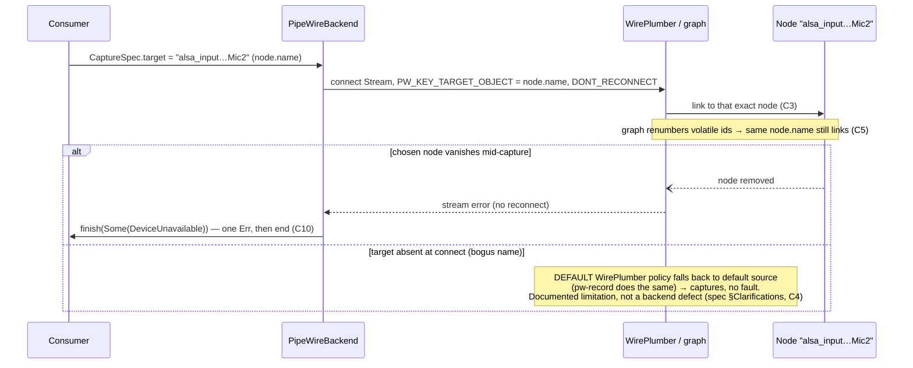
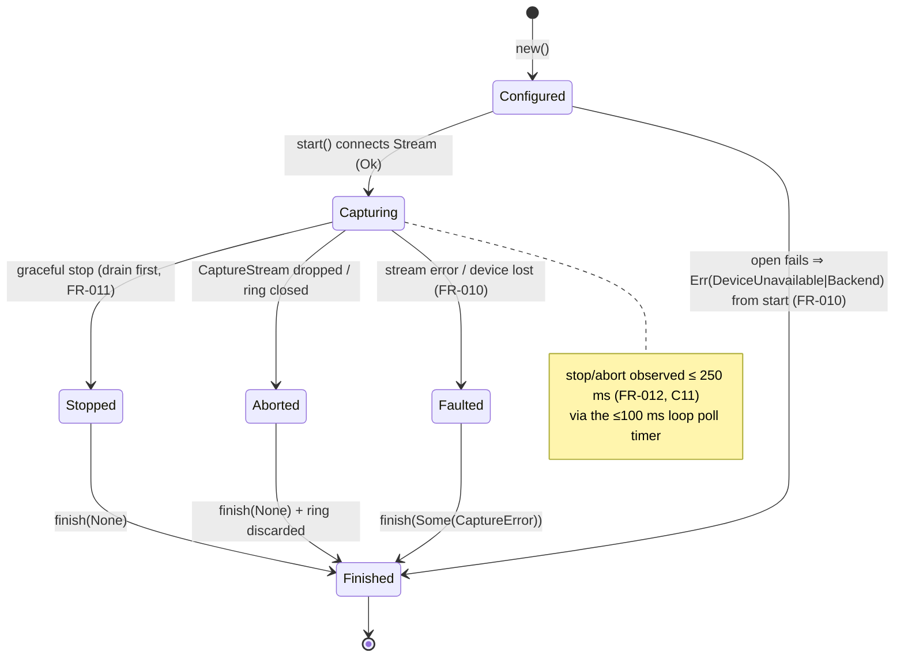
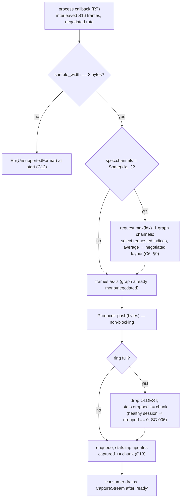
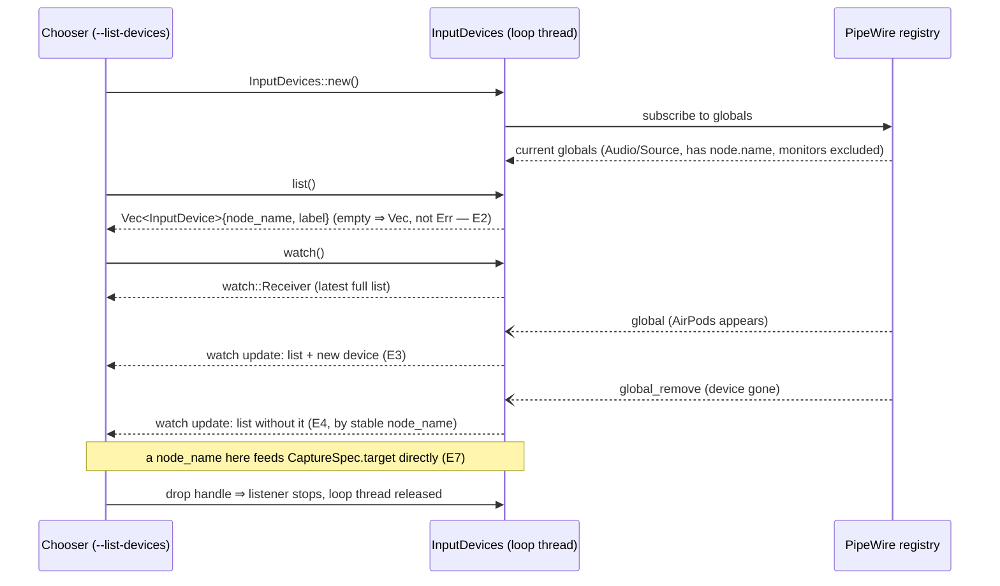

# Diagrams: Native PipeWire Capture Backend

**Feature**: `002-native-pipewire-backend` · **Crate**: `rust/myna-audio`

Visual companion to [spec.md](spec.md), [data-model.md](data-model.md), and the
contracts ([capture-backend.md](contracts/capture-backend.md) guarantees C1–C14,
[device-enumeration.md](contracts/device-enumeration.md) guarantees E1–E7). These
document the **shipped** design (native `pipewire-rs`, graph-side conversion, no
in-crate DSP) — distinct from the earlier `001-rust-audio-adapter` sketch
(PulseAudio fallback, in-process resample/VAD). Cross-ref the runtime docs in
`docs/audio-adapter-api.md` (§5 backends, §7 conversion, §9 channels).

## 1. Architectural block diagram

`PipeWireBackend` drops in behind the **unchanged** `CaptureBackend` seam; the
adapter core (`CaptureSource` = ring + stats tap + re-chunker) and the consumer
types are untouched (FR-002). `InputDevices` is an independent sibling entry
point sharing only the PipeWire connection model. The RT side is the PipeWire
loop thread's `process` callback; the consumer side is whatever thread drains
`CaptureStream` (in production, the `myna-orchestrator` FSM via `myna-dictate`).

## 2. Sequence: push-to-talk session — capture at press, drain after ready (C1, C8, FR-009)

The ring fills from the moment of press; the *push* to the consumer is what waits
on the model being `ready`, so nothing said during a cold load is lost (up to
ring depth). Graceful stop drains, then ends with no `Err`.

## 3. Sequence: graph-side format conversion (C2, FR-003)

The backend requests the **negotiated** format on the stream; when the device's
native rate/channels differ, the PipeWire graph converts — the crate never
resamples (adapters-never-resample invariant).

## 4. Sequence: device selection by stable node.name (C3, C5) + limitations (C4, C10)

Selection uses `PW_KEY_TARGET_OBJECT` (stable `node.name`), so it is
renumber-invariant by construction. `DONT_RECONNECT` is set when a target is
given, so a *chosen* device that vanishes faults. An **absent-at-start** bogus
target is a documented platform limitation (WirePlumber falls back to default).

## 5. State: `PipeWireBackend` lifecycle → exactly one terminal `finish` (C8–C11)

## 6. Flow: per-`process`-callback data path (C6, C12, C13)

## 7. Sequence: live input-device enumeration (E1–E4, FR-008/FR-008a)

`InputDevices` runs a registry listener on its own loop thread; `list()` is the
current snapshot, `watch()` publishes the latest full list as devices appear and
disappear — a chooser stays current without polling. Read-only, no audio (E6).

